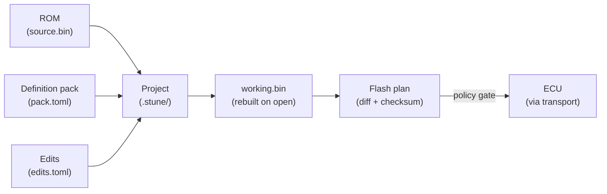

# Concepts overview

A one-page mental model. Each surface below has its own dedicated page;
this page exists so you can read it in order and understand how the
pieces fit before you go deeper.

## The five things SubuwuTuner manipulates

| Thing | Where it lives | Authoritative spec |
|---|---|---|
| **ROM** | a `.bin` on disk | [`docs/02-architecture.md`](https://github.com/BuffJesus/SubuwuTuner/blob/main/docs/02-architecture.md){ target="_blank" } §`st::Rom` |
| **Definition pack** | a `.toml` file or directory | [Definition format](../reference/definition-format.md) |
| **Project** | a `.stune` directory | [.stune projects](stune-projects.md) |
| **Edits** | `edits.toml` inside the project | [.stune projects](stune-projects.md) |
| **Live ECU** | reached through a transport | [Transports](transports.md) |

## The flow

- **Read once, edit forever.** The source ROM is read into the project
  and never modified. `working.bin` is the source plus every edit in
  `edits.toml`, re-derived on every open.
- **Definitions are the schema.** A ROM is bytes; a definition pack
  turns bytes into typed tables with axes, scaling, units, and policy
  flags. Swap definitions, get a different view of the same bytes.
- **Edits are deterministic.** Every mutation lives in `edits.toml` as
  a structured TOML record. Undo/redo walks that list. So does git.
- **Flashing is a derived operation.** The flash plan is computed
  from the diff between `source.bin` and `working.bin`, then
  per-sector erase/write/verify against the live ECU via a transport.

## What the GUI and CLI actually do

Both are thin shells over the C++ core. **Every domain capability is
reachable from the CLI** (`subuwutuner-cli`). The GUI
(`subuwutuner-gui`) adds the table renderer, heatmap, command palette,
workspaces, and live datalogger cluster — but never exclusive
functionality.

A useful consequence: any workflow you can do interactively, you can
also script. CI can lint a pack, dump tables, project-validate, and
sanity-check edits before they're committed.

## The C++ modules at a glance

| Module | Purpose |
|---|---|
| `st::core` | Result type, error catalog, file IO primitives |
| `st::Rom` | ROM read/write, CRC32, sector hashing, identification |
| `st::Definition` | TOML pack loader, scaling + inverse, axis/table extraction, diff |
| `st::edit` | Rect-scoped ops, Snapshot, History (undo/redo, branching) |
| `st::Project` | `.stune` directory persistence, per-ROM histories |
| `st::transport` | ITransport, MockTransport, J2534, OBDX, native handheld |
| `st::ecu::ssm` | SSM K-line + ISO-TP CAN client |
| `st::ecu::uds` | UDS catalog (DSC/SA/RDBI/WDBI/RMBA/WMBA/Routine/Download/Transfer/Exit) |
| `st::flash` | Orchestrator: delta, manifest, journal-resume, audit |
| `st::log` | LiveBuffer SPSC ring, LogSession, sinks |
| `st::can`, `st::dbc`, `st::discover` | CAN replay, DBC, baseline + change detection |
| `st::autotune` | MAF + knock-pull kernels, engine-safety linting |
| `st::feature` + `st::feature_codegen` | Node-graph designer → SH-2A / RH850 ROM patches |
| `st::tune_export` | Sum-preserving cal writes for LF79xxxP ECUs |
| `st::audit` | CRC32-protected append-only log across UDS + Flasher |

Architecture detail in [`docs/02-architecture.md`](https://github.com/BuffJesus/SubuwuTuner/blob/main/docs/02-architecture.md){ target="_blank" }.

## Where to go next

- [Definition packs](definition-packs.md) — what a pack is, what's
  inside, where to get them.
- [.stune projects](stune-projects.md) — the on-disk shape of your
  in-flight tune.
- [Transports](transports.md) — how SubuwuTuner reaches a real ECU.
- [Security Access](security-access.md) — UDS 0x27 variants and which
  one to use.
- [Brick protection](brick-protection.md) — the safety subsystem that
  gates everything `st::flash` does.
