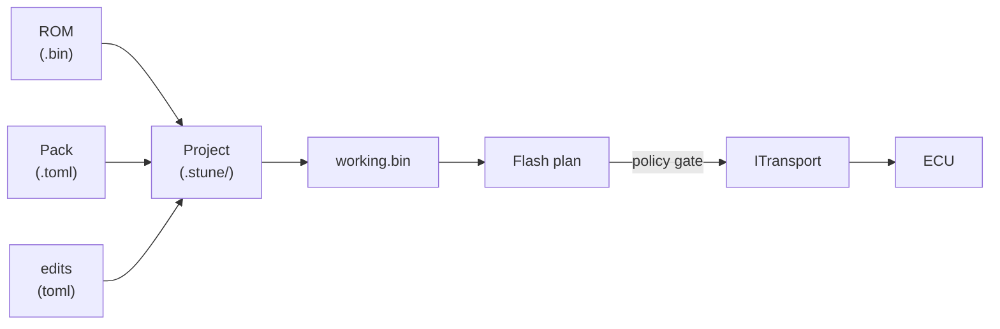

# Architecture

A two-page mental model for anyone modifying the codebase. The
authoritative architecture doc is
[`docs/02-architecture.md`](https://github.com/BuffJesus/SubuwuTuner/blob/main/docs/02-architecture.md){ target="_blank" };
this page is the front-door summary.

## The pipeline at a glance



## Layering

```
+-----------------------------------------------------------+
|  UI                                                       |
|  ┌─────────────────────┐    ┌─────────────────────┐       |
|  │  subuwutuner-gui    │    │  subuwutuner-cli    │       |
|  │  (ImGui + ImPlot)   │    │  (headless)         │       |
|  └──────────┬──────────┘    └──────────┬──────────┘       |
+-------------┼-------------------------- ┼----------------+
|  Application                                              |
|  ┌──────────┴────────────────────────────┴──────────┐     |
|  │  st::Project · st::edit · st::audit · st::config │     |
|  └──────────────────────┬───────────────────────────┘     |
+-------------------------┼----------------------------------+
|  Domain                                                   |
|  ┌──────────────────────┴────────────────────────────┐    |
|  │  st::Rom · st::Definition · st::flash · st::log   │    |
|  │  st::autotune · st::feature · st::tune_export     │    |
|  └──────────────────────┬────────────────────────────┘    |
+-------------------------┼-----------------------------------+
|  Protocol                                                 |
|  ┌──────────────────────┴────────────────────────────┐    |
|  │  st::ecu::ssm · st::ecu::uds · subaru_security    │    |
|  └──────────────────────┬────────────────────────────┘    |
+-------------------------┼-----------------------------------+
|  Transport                                                |
|  ┌──────────────────────┴────────────────────────────┐    |
|  │  ITransport (Mock · OBDX · J2534 · handheld)      │    |
|  └───────────────────────────────────────────────────┘    |
+-----------------------------------------------------------+
```

Domain has **no ImGui or USB types in its public headers**. The
application layer wires services together. UI binds to the application
layer, never directly to the domain.

## Cross-cutting invariants

- **No exceptions in domain code.** `st::Result<T>` is portable via
  feature-detected fallback to `tl::expected` when `<expected>` isn't
  available. Exceptions only at UI boundaries.
- **No global state.** Services dependency-injected into the
  application layer.
- **C++23 throughout.** `snake_case` functions/variables, `PascalCase`
  types, `kPascalCase` constants.
- **Formatter is law.** `clang-format` (LLVM base, 4 spaces, 100 cols,
  pointer-binds-right) is a CI gate.
- **Clean-room methodology.** Analyst/implementer wall in
  [`docs/15-clean-room-engineering.md`](https://github.com/BuffJesus/SubuwuTuner/blob/main/docs/15-clean-room-engineering.md){ target="_blank" };
  what you can read, what you can't, where AI-tool contamination channels
  appear.

## Module map

See [Concepts → Overview](../concepts/overview.md) for the module table.

## Deeper detail

- [`docs/02-architecture.md`](https://github.com/BuffJesus/SubuwuTuner/blob/main/docs/02-architecture.md){ target="_blank" } — full architecture spec.
- [`docs/03-tech-stack.md`](https://github.com/BuffJesus/SubuwuTuner/blob/main/docs/03-tech-stack.md){ target="_blank" } — compiler, build, GUI, library choices.
- [`docs/15-clean-room-engineering.md`](https://github.com/BuffJesus/SubuwuTuner/blob/main/docs/15-clean-room-engineering.md){ target="_blank" } — clean-room methodology.
- [`docs/41-async-worker-model.md`](https://github.com/BuffJesus/SubuwuTuner/blob/main/docs/41-async-worker-model.md){ target="_blank" } — async worker model inside `st::devices::ets::Client`.
