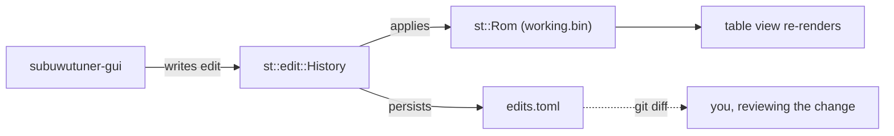

# Quickstart

5-minute path from a fresh build to your first tune edit. Assumes you've
already cloned and built per [Install](installation.md). No hardware
required — this round-trips against the synthetic demo project shipped
in the repo.

## TL;DR

```bash
cmake --preset win-mingw
cmake --build --preset win-mingw
./build/win-mingw/bin/subuwutuner-gui.exe
```

Click **"Try the demo project"** on the welcome panel. You're in.

## Walkthrough

### 1. Launch the GUI

```bash
./build/win-mingw/bin/subuwutuner-gui.exe
```

(Or `subuwutuner-gui` on Linux/macOS, with whichever preset you built.)

First launch shows the welcome panel with three actions: **Open project**,
**New project**, and **Try the demo project**.

### 2. Open the demo

Click **Try the demo project**. The demo loads:

- A synthetic ROM (`fixtures/demo-pack/demo-rom.bin`) with hand-crafted
  fake tables — Fuel Main, Ignition Main, Boost Target, MAF, etc.
- A matching definition pack (`fixtures/demo-pack/pack.toml`) describing
  every table's address, scaling, axes, units, and policy flags.
- A blank `.stune` project at `fixtures/demo.stune/` that the GUI's
  history layer will write your edits into.

### 3. Pick a table and edit it

1. In the sidebar (left), expand a category. **Fuel** is a good first
   stop — synthetic but recognizable shape.
2. Pick **Fuel Main**. The table view opens with a heatmap.
3. Click any cell, type a new value, press <kbd>Enter</kbd>.
4. The new value highlights as edited. The **History panel** (right)
   shows your edit with a timestamp.

### 4. Undo, redo, save

- <kbd>Ctrl</kbd>+<kbd>Z</kbd> walks the history back.
- <kbd>Ctrl</kbd>+<kbd>Shift</kbd>+<kbd>Z</kbd> redoes.
- <kbd>Ctrl</kbd>+<kbd>S</kbd> persists to disk. Open
  `fixtures/demo.stune/edits.toml` in any text editor — your edits are
  there as plain TOML, diffable in git, replayable.

That's the entire editing loop. Everything you'll do on a real ROM
works the same way.

## What just happened, in module terms



- **`st::edit::History`** owns every mutation. Undo/redo are first-class
  operations, not bolted on.
- **`st::Rom`** holds two buffers per project — `source.bin` (the
  ROM you started from, never modified) and `working.bin` (source +
  applied edits). The diff between them is what you'd flash.
- **`edits.toml`** is the source of truth on disk. The history layer
  rebuilds `working.bin` by replaying `edits.toml` over `source.bin` on
  every project open.

The `.stune` directory layout is fully documented at
[.stune projects](../concepts/stune-projects.md).

## Useful keybindings

| Key | Action |
|-----|--------|
| <kbd>F1</kbd> | Context-aware help — lands on the doc topic for whatever panel you're in |
| <kbd>Ctrl</kbd>+<kbd>K</kbd> | Command palette — search every action, table, and recent file |
| <kbd>Ctrl</kbd>+<kbd>1</kbd> / <kbd>2</kbd> / <kbd>3</kbd> | Switch Tune / Datalog / Features workspaces |
| <kbd>Ctrl</kbd>+<kbd>Z</kbd> | Undo |
| <kbd>Ctrl</kbd>+<kbd>Shift</kbd>+<kbd>Z</kbd> | Redo |
| <kbd>Ctrl</kbd>+<kbd>S</kbd> | Save project |

The **status bar** along the bottom shows project save state, active
jurisdiction profile, and the active workspace.

## Same thing from the CLI

The GUI is a thin shell over `subuwutuner-cli`. The demo round-trip in
shell form:

```bash
# What does the demo pack contain?
subuwutuner-cli pack-info fixtures/demo-pack/

# Dump a table to stdout
subuwutuner-cli dump-table --def fixtures/demo-pack/ \
                           --table fuel_main \
                           fixtures/demo-pack/demo-rom.bin

# Edit a single cell from the CLI (writes through st::edit::History too)
subuwutuner-cli table-edit --project fixtures/demo.stune/ \
                           --table fuel_main \
                           --cell "3,4" \
                           --value 14.7

# Project state after the edit
subuwutuner-cli project-info fixtures/demo.stune/
```

Every domain capability the GUI exposes is reachable from the CLI. See
[CLI Overview](../cli/overview.md) for the full subcommand list, or run
`subuwutuner-cli --help`.

## Next steps

| Want to… | Read |
|---|---|
| Walk through the demo end-to-end with screenshots | [Your first tune](first-tune.md) |
| Understand the design | [Concepts → Overview](../concepts/overview.md) |
| Reverse-engineer CAN traffic | [`docs/14-can-reverse-engineering.md`](https://github.com/BuffJesus/SubuwuTuner/blob/main/docs/14-can-reverse-engineering.md){ target="_blank" } |
| Auto-tune from datalogs | [`docs/12-auto-tuning.md`](https://github.com/BuffJesus/SubuwuTuner/blob/main/docs/12-auto-tuning.md){ target="_blank" } |
| Author a custom feature (flat-foot, clutch-kill, etc.) | [`docs/16-custom-features.md`](https://github.com/BuffJesus/SubuwuTuner/blob/main/docs/16-custom-features.md){ target="_blank" } |
| Contribute | [Contributing → Building](../contributing/building.md) + [Architecture](../contributing/architecture.md) |
| Diagnose install issues | `subuwutuner-cli doctor` |

## Common first-time questions

**"Why doesn't the GUI show any tables?"** No definition pack loaded for
the current project. The demo pack ships in the repo. For real ROMs,
point a project at a TOML pack via `project-new --def <path>`. See
[Install](installation.md).

**"Where do my recent projects + settings live?"** Per-platform
user-data dir. Windows: `%APPDATA%\SubuwuTuner\`. Linux:
`~/.config/subuwutuner/`. macOS:
`~/Library/Application Support/SubuwuTuner/`. Settings are TOML and
human-readable; edit by hand if you must.

**"How do I undo everything I just did?"** <kbd>Ctrl</kbd>+<kbd>Z</kbd>
walks the history back one step at a time. The History panel shows the
full sequence and lets you jump to any prior state. Workflow batches
(e.g., FA24 swap) collapse into single "Revert all" actions via tag
groups.

**"Will this flash my car right now?"** No. Flashing is gated on
bench-rig validation per
[`docs/04-roadmap.md`](https://github.com/BuffJesus/SubuwuTuner/blob/main/docs/04-roadmap.md){ target="_blank" }.
The CLI's `project-flash` runs end-to-end against `MockTransport`; live
flashing is in active development.
