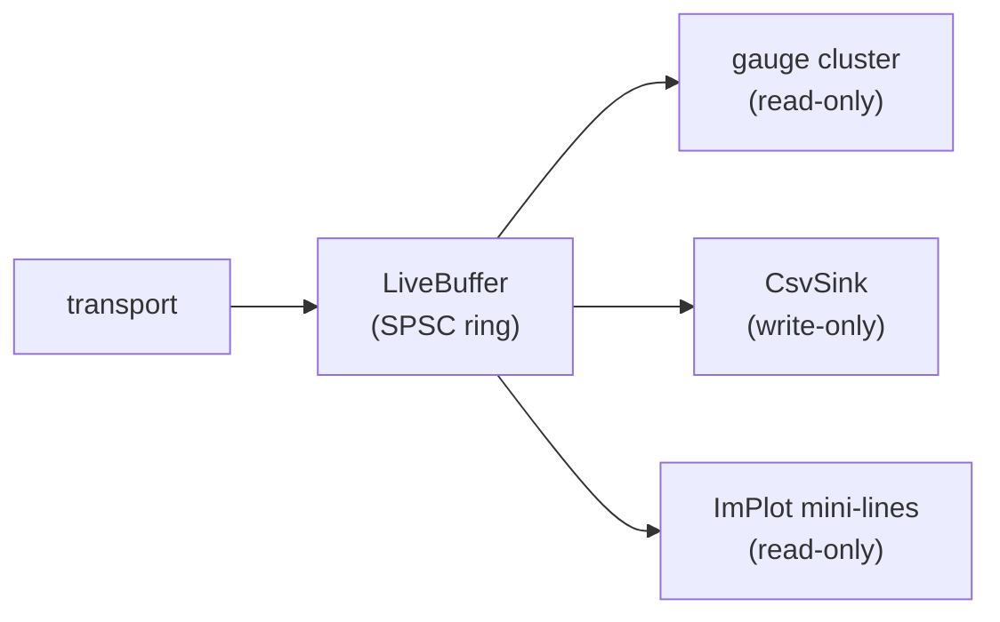

# Datalogging

`subuwutuner-cli log` and the GUI's Datalog workspace expose the same
multi-sink datalogger pipeline. Live gauge cluster, CSV recording, and
post-hoc replay all run through `st::log::LogSession`.

## From the CLI

```bash
# Log a fixed list of PIDs at 50 Hz to CSV
subuwutuner-cli log \
    --transport obdx --device COM5 \
    --def path/to/pack-dir/ \
    --pid rpm --pid ecu_load --pid afr --pid ign_total \
    --rate 50 \
    -o session.csv

# Log every PID in the pack
subuwutuner-cli log \
    --transport obdx --device COM5 \
    --def path/to/pack-dir/ \
    --all-pids \
    -o session.csv
```

PID definitions come from the pack's `pids.toml` and per-CID
`ecuparams/<cid>.toml` fragments. The 91 standard SSM PIDs ship in
`definitions/pids.toml`; per-CID extended PIDs you supply per your
target ECU.

## From the GUI

Workspace → **Datalog**. The live gauge cluster opens; pick PIDs from
the sidebar, drag onto the canvas as gauges or mini-plots. Hit the
record button to write to CSV while gauging — recording and gauging
share the same `LogSession` SPSC ring, no double-tap.

## Recording while gauging

The pipeline shape:



The SPSC ring is the fan-out point — every sink reads independently. A
slow sink can't block the live render or vice versa.

## Knock snapshots

When the knock signal exceeds a configurable threshold, the GUI
captures a snapshot — N seconds of every PID around the event — and
adds it to the Knock Inspector panel.

```bash
# Same thing from the CLI, post-hoc against a recorded session
subuwutuner-cli knock-snapshot --json session.csv > knock-events.json
```

## Cold-start analysis

```bash
subuwutuner-cli coldstart-analyze --csv session.csv > coldstart.csv
```

Picks the cold-start window out of a longer session and reports the
warmup curve, lambda settling time, ign retard during enrichment, etc.

## CAN sniffing (advanced)

`subuwutuner-cli can-*` is the layer below `log`. Use it when you want
to capture raw frames rather than decoded PIDs (e.g., to discover new
signals or RE a feature):

```bash
# Capture to .asc
subuwutuner-cli can-replay --capture session.asc \
    --transport obdx --device COM5 --filter "0x7E0,0x7E8"

# Diff against a baseline
subuwutuner-cli can-diff --baseline baseline.cdb new.asc
```

Methodology + signal-discovery workflow:
[`docs/14-can-reverse-engineering.md`](https://github.com/BuffJesus/SubuwuTuner/blob/main/docs/14-can-reverse-engineering.md){ target="_blank" }
and
[`docs/24-sniff-workflows.md`](https://github.com/BuffJesus/SubuwuTuner/blob/main/docs/24-sniff-workflows.md){ target="_blank" }.

## Deeper detail

- [`docs/32-live-datalogger.md`](https://github.com/BuffJesus/SubuwuTuner/blob/main/docs/32-live-datalogger.md){ target="_blank" }
  — LiveBuffer + LogSession + ImPlot mini-lines + record-while-gauging.
- [`docs/29-ssm-a8-poll-workflow.md`](https://github.com/BuffJesus/SubuwuTuner/blob/main/docs/29-ssm-a8-poll-workflow.md){ target="_blank" }
  — SSM-A8 RAM polling for tuner-pack DID layout recovery.
