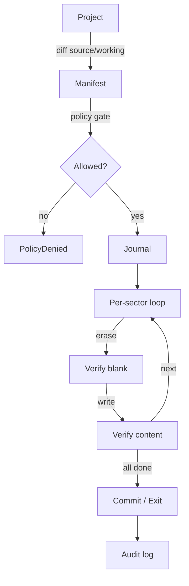

# Flashing safely

!!! danger "Current hardware gate (2026-08-02)"
    The LF79002P bench ECU is silent after the round-57 flash incident.
    Do not attempt another OBD write or run the live validation sequence
    until the exact-board recovery/replacement gate in
    [`docs/43`](../43-jtag-recovery.md),
    [`docs/49`](../49-diy-sh2a-recovery-probe.md), and
    [`docs/50`](../50-replacement-ecu-intake.md) is satisfied. ROM
    preparation, diffing, checkpointing, and policy work can continue
    offline.

How `st::flash` writes a tuned calibration to an ECU without bricking
it. **Live-ECU flashing is currently bench-gated** — see status note
below.

!!! warning "Status (2026-06-19)"
    The flash orchestrator runs end-to-end against `MockTransport` and
    has been driven through partial live sequences on the bench rig.
    **A live flash to a customer car is not yet supported** — the gate
    is the bench-rig validation runbook
    ([`docs/42`](https://github.com/BuffJesus/SubuwuTuner/blob/main/docs/42-bench-rig-validation-runbook.md){ target="_blank" })
    + JTAG recovery
    ([`docs/43`](https://github.com/BuffJesus/SubuwuTuner/blob/main/docs/43-jtag-recovery.md){ target="_blank" }).
    Everything below describes what the orchestrator does when the gate
    clears.

## The flow



## Dry-run first

```bash
subuwutuner-cli project-flash my-tune.stune --dry-run
```

Emits the manifest — exact sectors, pre- and post-checksums, expected
runtime, and the policy-gate decision — without sending a single wire
byte. Read this before any real flash.

## Tune-export pipeline (LF79xxxP)

For FA20DIT (SH-2A LF79xxxP family) calibration writes, the boot
integrity contract constrains what a calibration write may touch.
`st::tune_export` implements that contract.

!!! warning "No front-end yet"
    `st::tune_export` currently has **no CLI or GUI surface** — the
    library is built and unit-tested, but `subuwutuner-cli` does not link
    it and there is no `tune-export-*` subcommand. Until one lands, the
    behaviour below is reachable only from C++ (see
    `tests/unit/tune_export/test_tune_export.cpp` for worked examples).
    Build your flashable image by other means and verify it with
    `checksum-verify`.

What the library does:

- Verifies your candidate image against the per-ISA boot-integrity contract
- Skips writes into write-locked regions
- Preserves the contract's required invariants by emitting compensating writes where needed
- Emits a skip-unchanged-blocks write plan (delta-flash friendly)

Cross-CID validated across LF79002P (bench donor) and LF79101P (the
e-tune CID on Cornelio's car). The contract specifics — addresses,
ranges, invariants — live in the spec.

Spec:
[`docs/44-tune-export.md`](https://github.com/BuffJesus/SubuwuTuner/blob/main/docs/44-tune-export.md){ target="_blank" }.

## Preview the flash (hardware-free)

`project-flash` takes the project directory as a **positional** argument.
Without `--trace` it stops after the policy gate and prints what the
flash would do — it never opens a transport:

```bash
subuwutuner-cli project-flash my-tune.stune
```

Add `--trace <FILE.uds>` to replay a recorded UDS trace through
`MockTransport` — still hardware-free, but it exercises the whole
orchestrator. `project-flash` has no transport flags at all; it is a
preview and dry-run verb only.

## Run the flash (when the gate clears)

Live hardware writes go through `flash-apply`, which takes a **flash
plan**, not a project directory. Build the plan from your flashable
image first:

```bash
subuwutuner-cli flash-delta \
    my-tune.stune/rom/source.bin flashable.bin \
    --layout fa-dit-sh2a-2mb \
    --output my-flash.plan.toml
```

The plan is hand-editable — read it before you send it. Then apply it:

```bash
subuwutuner-cli flash-apply \
    --plan my-flash.plan.toml \
    --transport obdx --device COM5 \
    --authenticate --sa-variant ssmcan1-factory \
    --journal my-flash.journal.toml \
    --manifest my-flash.manifest.toml \
    --confirm --reason "Stage 1 e-tune, bench validated"
```

`--transport` refuses to run without `--confirm`; `--reason` records the
justification. Add `--profile <P> --def <pack.toml> --source <rom.bin>`
to run the emissions/jurisdiction gate over the plan as well.

`flash-apply` applies the SA prelude, opens the Programming session
(DSC 0x10 0x02), erases each sector, writes through TransferData (0x36)
or — if armed — the 0xB6 bulk-transfer path, verifies each sector, and
journals every step.

Swap `--transport obdx --device COM5` for `--trace <FILE.uds>` to run
the identical path against a recorded trace instead of the car.

## Resume after power loss

Resume is a separate verb. It takes the original plan plus the journal
written by the interrupted run, and emits a new plan covering only what
is left:

```bash
subuwutuner-cli flash-resume \
    my-flash.plan.toml my-flash.journal.toml \
    --output resumed.plan.toml

subuwutuner-cli flash-apply \
    --plan resumed.plan.toml \
    --transport obdx --device COM5 \
    --authenticate --sa-variant ssmcan1-factory \
    --confirm --reason "resume after power loss"
```

The journal captures every verified step, so the resumed plan picks up
from the last verified one. The orchestrator re-verifies the boundary
before continuing.

## The 0xB6 bulk-transfer path (off by default)

The optional gated path:

```bash
# Build-time
cmake --preset win-mingw -DST_ENABLE_BULK_REFLASH_CIPHER=ON

# Run-time
subuwutuner-cli --enable-bulk-reflash-cipher flash-apply --plan ...
```

(`--enable-bulk-reflash-cipher` is a global flag — it may appear
anywhere in the command line.)

Both gates are required. Trade-off + failure modes:
[`docs/26-bulk-reflash-cipher.md`](https://github.com/BuffJesus/SubuwuTuner/blob/main/docs/26-bulk-reflash-cipher.md){ target="_blank" }.

## If something goes wrong

- **Verify failure mid-flash.** Orchestrator halts immediately. Build a
  resumed plan with `flash-resume <plan> <journal>`, then re-run
  `flash-apply` against it; the resume path re-verifies before
  continuing.
- **NRC 0x22 from the commit routine.** The boot-integrity contract
  check failed. Re-verify your image with `checksum-verify`; the most
  likely cause is a miscalculated compensating write — the sum over
  `[0x6000, 0x200000)` must still land on `0x5AA5`.
- **ECU silent on the bus after a failed write.** Likely boot integrity
  failure. JTAG recovery procedure:
  [`docs/43-jtag-recovery.md`](https://github.com/BuffJesus/SubuwuTuner/blob/main/docs/43-jtag-recovery.md){ target="_blank" }.

## Deeper detail

- [Brick protection](../concepts/brick-protection.md) — model + safety guarantees.
- [`docs/31-brick-protection-by-isa.md`](https://github.com/BuffJesus/SubuwuTuner/blob/main/docs/31-brick-protection-by-isa.md){ target="_blank" } — per-ISA recipes.
- [`docs/37-subaru-flash-protocol.md`](https://github.com/BuffJesus/SubuwuTuner/blob/main/docs/37-subaru-flash-protocol.md){ target="_blank" } — Subaru UDS flash sequence reference.
- [`docs/40-delta-flash-brick-protection.md`](https://github.com/BuffJesus/SubuwuTuner/blob/main/docs/40-delta-flash-brick-protection.md){ target="_blank" } — v1.5 differential-flash extension.
- [`docs/42-bench-rig-validation-runbook.md`](https://github.com/BuffJesus/SubuwuTuner/blob/main/docs/42-bench-rig-validation-runbook.md){ target="_blank" } — bench validation runbook.
