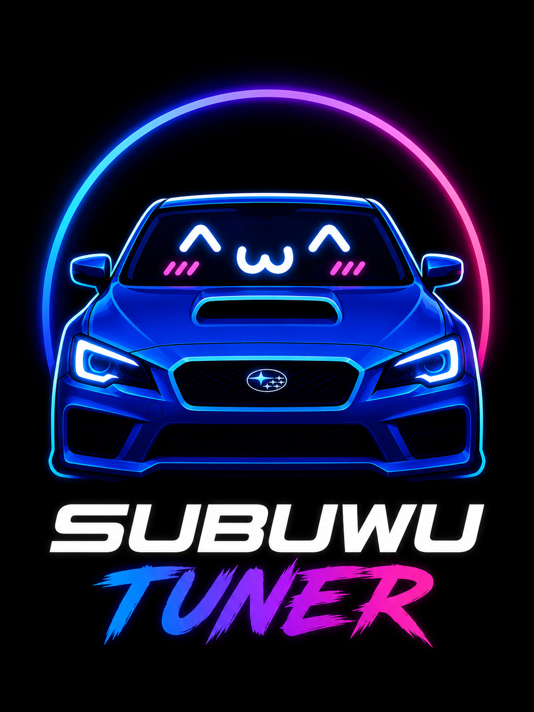

<p align="center">
  <!-- Mascot: drop SubuwuTunerLogo.png at assets/logo.png (or update the src here). -->
  
</p>

<h1 align="center">SubuwuTuner</h1>

<p align="center">
  <em>Making Subaru ECUs slightly less mysterious, one ROM at a time.</em><br>
  <strong>Cute mascot. Serious hex dumps.</strong>
</p>

<p align="center">
  <a href="LICENSE"></a>
  
  
  
</p>

---

## What Is SubuwuTuner?

SubuwuTuner is an open-source research and tooling project for Subaru ECUs. The work is split across several adjacent tracks:

- **ROM definition development** — TOML schema for documenting calibration tables, axes, scaling, units, and policy flags
- **ECU communication research** — SSM (K-line + CAN) and UDS protocol clients, SecurityAccess seed/key recovery, definition-driven map reads
- **CAN protocol analysis** — replay, DBC decode, baseline modeling, change detection, `.cdb` bundle format
- **Logging and diagnostics tooling** — multi-sink datalogger, live gauge cluster, CSV export
- **Flashing infrastructure research** — flash orchestrator, manifest + journal, backup store, per-ISA brick-protection model, security-access variants
- **Reverse engineering and documentation** — bench rig with junkyard ECUs, written handoffs between analyst and implementer sessions, design docs numbered `docs/00` through `docs/44`

The project is C++23 throughout, Apache 2.0 licensed, headless-first (every GUI capability is reachable from the `subuwutuner-cli`), and cross-platform from day one.

A name like SubuwuTuner is a deliberate choice. The codebase is not.

---

## Features

Listed honestly. Working means *runs end-to-end today*. Experimental means *the code path is real but real-world coverage is thin*. Research in progress means *active investigation*. Planned means *not started or sketched only*.

### Working

- **ROM viewer + diff** — raw binary load, CRC32 / sector hashing, structured per-cell diff, JSON envelope for CI scripting (`rom-info`, `dump-table`, `dump-axis`, `rom-diff`, `diff`)
- **Definition pack loader** — TOML schema with `extends` inheritance, validation, hygiene linting (`pack-info`, `pack-lint`)
- **Definition generation pipeline** — `tools/defgen/` (Python) lifts factual data from public XML schemas into the TOML pack format
- **`.stune` project model** — directory-backed, diffable, `working.bin` + `source.bin` + `edits.toml` with audit history (`project-new`, `project-info`, `project-validate`, `project-clone`)
- **Table editor with full undo/redo** — selection, paste, smooth, interpolate, percent-scale, bulk CSV import/export; every operation goes through `edit::History`
- **Jurisdiction profile system** — first-run profile (`motorsport-only`, `alberta-ca`, `eu-roadworthy`, `california-us`) drives edit-time warnings on emissions-flagged tables
- **DTC bitmap toggles** — `[[dtc_bitmap]]` schema in packs; toggles route through the history layer so they undo cleanly
- **Auto-tune kernels** — MAF scaling kernel and knock-pull ignition kernel, both with engine-safety linting on by default; previewable as `edit::History` proposals before commit
- **Custom-features designer** — visual node-graph editor (`.stmod` files), graph linter, IR lowering, SH-2A *and* RH850 backends at 22-primitive parity
- **CAN reverse-engineering toolkit** — replay, DBC parse/emit/decode, `BaselineModel` + `ChangeDetector`, `.cdb` bundle (`can-replay`, `can-diff`, `can-discover`, `can-decode`, `can-export-dbc`)
- **Datalogger pipeline** — `LiveBuffer` SPSC ring, `LogSession` multi-sink fan-out, `CsvSink` for downstream tooling
- **Transport stack** — `ITransport` abstraction with J2534 v04.04, OBDX Pro VX (DVI codec), native handheld (custom framed codec), and `MockTransport` for tests
- **ECU protocol clients** — SSM (K-line + ISO-TP CAN), UDS (DSC, SA, RDBI/WDBI, RMBA/WMBA, RequestDownload, TransferData, RequestTransferExit, SubaruBulkTransfer)
- **SecurityAccess recovery** — Subaru SSMCAN1 family: factory 16-round Feistel + aftermarket L1 + L3 variants, CLI-selectable via `--sa-variant`
- **Audit log** — CRC32-protected append-only log, wired across UDS + Flasher; tamper-evident, NDJSON export
- **CLI** — 70+ subcommands covering every domain capability; structured emitters offer `--json` for scripting
- **Cross-platform build** — Win MSVC, MinGW-w64, Apple Clang (Intel + Apple Silicon), Linux GCC, Linux Clang (ASan + UBSan)

### Experimental

- **Live datalogger over OBDX** — sustained streaming is wired and bench-tested; the high-rate (50 Hz × 20 PIDs) sustained target needs more real-vehicle coverage
- **Flash orchestrator** — `FlashPlan` + manifest + journal + backup-store + `FlashPreflight` policy gate run end-to-end against `MockTransport`; live-ECU validation is the active bench-rig work
- **Tune library + tuning-knowledge reference** — local sortable catalog with delta-detection heuristics; the per-cell delta sign convention has a known issue queued for fix

### Research In Progress

- **Phase D flash-protocol close-out** — bench-rig RE of the Subaru bulk-transfer state machine. As of round 30, `0x34` → `0xB6` → `F6` writes flash bytes successfully; the close-out sequence (`0x37` → `0xB7`) is dispatched but the state-byte=1 setter is still untraced
- **Per-ISA brick-protection HIL coverage** — host-side recovery model documented for SH-2A (single-bank serial-boot) and RH850 (dual-bank atomic-swap); bench-rig HIL coverage is the remaining ship gate
- **Patch insertion layer** (`src/feature_patch/`) — finds free RAM, writes hook tables, splices into existing vector tables; needs real ECU vector tables to develop against

### Planned

- Checksum-repair algorithm implementations (the `IChecksumRepair` seam is in place; concrete `subaru_std` / `subaru_alt` / `subaru_alt2` impls wait on byte-validation against known-stock dumps)
- Installer + signed manifest auto-update channel (`docs/22-auto-update.md`)
- Documentation site (MkDocs or similar)
- Closed-loop trim integration for MAF auto-tune
- Boost-trim auto-tune kernel
- STI variants, EJ-era cars, AT variants, BRZ / 86 expansion
- Standalone Doc-18 master plan (PC-tethered handheld) — `docs/18-standalone-master-plan.md`

---

## Supported Platforms

### ECU families

| Family | v1.0 ship target | Bench-rig coverage | Notes |
|---|---|---|---|
| **FA20DIT / SH-2A (VA 2015–2021 WRX MT)** | yes | LF79002P junkyard ECU on bench | Primary v1.0 platform |
| **FA24DIT / RH850 (VB 2022+ WRX MT)** | yes | RH850 codegen at SH-2A parity; bench coverage pending hardware | Primary v1.0 platform |
| EJ-era WRX / STI / Forester | v1.x | — | Definition packs and flash routines after v1.0 |
| BRZ / 86 (FA20 / FA24 NA) | v1.x | — | Pack development tracked in `docs/04-roadmap.md` |

### Host platforms

| Capability | Windows | macOS | Linux |
|---|:-:|:-:|:-:|
| GUI, CLI, project work, ROM viewer / editor | ✅ | ✅ | ✅ |
| TOML pack loader + `defgen` pipeline | ✅ | ✅ | ✅ |
| Auto-tune kernels (MAF + knock-pull) | ✅ | ✅ | ✅ |
| Custom-features designer (SH-2A + RH850 codegen) | ✅ | ✅ | ✅ |
| CAN replay / DBC decode / `.cdb` discovery | ✅ | ✅ | ✅ |
| Datalogging via OBDX Pro VX (USB-CDC) | ✅ | ✅ | ✅ |
| Flashing via OBDX Pro VX / native handheld | ✅ | ✅ | ✅ |
| Flashing via J2534 adapters | ✅ | Windows-only DLL | Windows-only DLL |
| Live CAN bus capture (`can-record --live`) | ✅ | ✅ | ✅ |

J2534 v04.04 is a Windows-DLL API; the OBDX / native paths are the cross-platform substitute.

---

## Architecture Overview

```
            ┌──────────────────────────────────────────────────────┐
            │                       GUI (Dear ImGui)               │
            │                       CLI (subuwutuner-cli, 70+)     │
            └────────────────────────┬─────────────────────────────┘
                                     │
            ┌────────────────────────▼─────────────────────────────┐
            │                Domain core (C++23, no UI)            │
            │                                                      │
            │  rom · defs · edit · project · profile · policy      │
            │  autotune · feature · feature_codegen · diff         │
            │  log · audit · library · config                      │
            └────────────────────────┬─────────────────────────────┘
                                     │
            ┌────────────────────────▼─────────────────────────────┐
            │              Hardware-touching layers                │
            │                                                      │
            │   transport   ecu (ssm + uds + dit + sa)             │
            │   can / dbc / discover                               │
            │   flash (orchestrator + manifest + journal)          │
            └──────────────────────────────────────────────────────┘
```

### ROM definitions

TOML pack format (`docs/11-definition-format.md`). Each table declares address, dimensions, axis layout, scaling, units, glossary text, and policy flags (`safety`, `emissions`). Packs inherit via `extends`; child packs override one field at a time without forking. `pack-lint` enforces hygiene in CI. `defgen` (Python, frozen as a per-platform PyInstaller binary in the release artifacts) lifts factual data from public ECU XML schemas into the TOML format.

### ECU communication

`st::transport::ITransport` is the wire abstraction. Concrete implementations: J2534 (Windows DLL ABI), OBDX Pro VX (DVI codec over USB-CDC), native handheld (custom framed codec), `MockTransport` (tests). Protocol clients on top: `st::ecu::ssm` (K-line and CAN framing), `st::ecu::uds` (standard ISO 14229 services + Subaru bulk-transfer `0xB6`), `st::ecu::subaru_dit` (DIT flash client). SecurityAccess is a `SecurityKeyFn` strategy: factory Feistel and aftermarket L1 / L3 variants live in `src/ecu/src/subaru_security.cpp`.

### Logging

`LiveBuffer` is an SPSC ring; `LogSession` fans out to N sinks. `CsvSink` is the bundled implementation. The GUI's live gauge cluster reads from the same buffer as the file sink, so you can record-while-gauging without extra glue.

### Flashing

`st::flash::Flasher::execute(plan, cancel)` walks a `FlashPlan` sector by sector. Pre-write: full-ROM backup via `BackupStore` (CRC-gated; the orchestrator refuses to run without a verified backup), `FlashPreflight` policy checks (`EcuIdMatch`, `VinMatch`, `BatteryVoltageOk`, `IgnitionState`, `ChecksumKnown`, `BackupStorePresent`), per-sector erase/write/verify with retry budgets. The manifest + journal pair makes power-loss resume idempotent. Recovery is per-ISA (SH-2A serial-boot path, RH850 atomic-swap path); the model is in `docs/31-brick-protection-by-isa.md`.

### Data extraction

Definition-driven map reads come through the `Definition` + `Rom` pairing: cell coordinates resolve via axes, scaling applies on read, units render in the editor. The `.stune` project format pins both the source ROM and the working ROM; every edit goes through `edit::History` and serializes to `edits.toml` (a TOML file you can diff, blame, and code-review).

### Definition generation

`tools/defgen/` walks a public ECU XML schema, extracts addresses + scalings + axis breakpoints (facts, not prose), and emits TOML packs that map to the SubuwuTuner schema. Per-platform mapping YAMLs handle the schema-evolution rules. The pipeline is fact-only by policy; OEM-authored description prose is not lifted.

---

## Repository Layout

```
code/
├── src/                       Domain core + tooling, organized by module
│   ├── core/                  Result, Error, units, span types
│   ├── rom/                   Raw ROM I/O, CRC32, sector hashes
│   ├── defs/                  TOML pack loader + Definition model
│   ├── edit/                  Edit ops + History (undo/redo)
│   ├── project/               .stune directory model
│   ├── policy/                FlashPreflight + jurisdiction gate
│   ├── profile/               Jurisdiction profiles
│   ├── transport/             ITransport + J2534 / OBDX / native / Mock
│   ├── ecu/                   SSM, UDS, DIT flash, SecurityAccess
│   ├── audit/                 Append-only audit log
│   ├── log/                   Datalogger pipeline + CSV sink
│   ├── can/                   CAN frame I/O, .asc handling
│   ├── dbc/                   DBC parser / emitter / decoder
│   ├── discover/              CAN signal discovery + .cdb bundle
│   ├── flash/                 Flasher + FlashPlan + manifest + journal
│   ├── autotune/              MAF + knock-pull kernels
│   ├── feature/               Custom-features Graph + IR
│   ├── feature_codegen/       SH-2A + RH850 backends
│   ├── feature_patch/         Patch insertion layer (in progress)
│   ├── diff/                  Structured ROM diff
│   ├── library/               Local tune library
│   ├── ai/                    Drift classifier + LLM explanations
│   ├── ui/                    Dear ImGui GUI (subuwutuner-gui)
│   └── cli/                   subuwutuner-cli
├── tools/
│   └── defgen/                Python definition-pack generator
├── docs/                      Design docs (00–44), getting-started, install
├── tests/unit/                Catch2 tests, by module
└── fixtures/
    ├── demo-pack/             Synthetic always-available example pack
    ├── demo.stune/            Demo project (exercisable from a fresh clone)
    └── samples/               Sample `.stmod` graphs and trace files
```

A more detailed read on any module lives in `src/<module>/include/` headers and the corresponding `tests/unit/<module>/`.

---

## Current Development Focus

Active work, summer 2026:

- **Phase D flash-protocol close-out** on the junkyard LF79002P bench rig. Rounds 14–30 of a structured analyst ↔ implementer loop have walked from cold ECU through DSC `0x10 0x02` unblock (Phase C), through bulk-transfer writes (Phase D), to the current question of how the state machine transitions to allow `0xB7` close-out. Handoff archive lives at `D:/Subuwu/findings/handoffs/`.
- **Per-ISA brick-protection HIL** on the same rig. SH-2A serial-boot recovery is documented in `docs/31`; RH850 atomic-swap design has open items the bench will settle.
- **Patch insertion layer** (`src/feature_patch/`) — design pinned in `docs/30-patch-insertion.md`. The custom-features designer already emits valid SH-2A and RH850 patch bytes; the insertion layer is what splices them into real ECU vector tables.
- **Live datalogger polish** — `LiveBuffer` and `LogSession` are wired; the next milestone is sustained-rate validation in a real car.

---

## Roadmap

Realistic. Not a hype list.

- **Definition pack coverage** — VA + VB WRX MT first (the bench-testable scope); STI, AT variants, EJ-era cars, BRZ / 86 as they clear pack development and flash routine validation
- **Definition generation improvements** — schema-evolution heuristics, multi-source merge, automated provenance reporting
- **Bench testing validation** — Tier 4 HIL coverage per `docs/08-testing-strategy.md`, deliberate-brick recipes per `docs/31`, 100-cycle success target before any car flash
- **CAN protocol research** — fault tolerance under noisy buses, multi-module discovery for engine swaps, automated DBC promotion from `.cdb` traces
- **Logging enhancements** — Aim-style standalone-record mode, multi-sink replay tooling, sustained 100 Hz × 20-PID target
- **Flashing infrastructure** — checksum-repair algorithm landings, delta-flash brick-protection per `docs/40`, journal-resume hardening
- **Custom-features tooling** — table-lookup primitives, broader hook coverage, end-to-end flash of community-published feature packs
- **Automated tooling** — fuzz coverage for the TOML pack loader, mutation tests on `st::flash` as a release gate, frozen `defgen` binary in CI artifacts
- **Documentation** — MkDocs site, design-doc cross-linking, glossary expansion, contributor onboarding flow

Full per-phase status in `docs/04-roadmap.md`.

---

## Contributing

Contributions are very welcome. The project benefits from a lot of different shapes of help:

- **Reverse-engineering findings** — write up what you learn about a Subaru ECU. The structured analyst ↔ implementer handoff format in `D:/Subuwu/findings/handoffs/` is one way; design docs in `docs/` are another
- **Definition packs** — TOML packs for additional CIDs. `pack-lint` will tell you what's missing
- **Testing** — Catch2 unit tests live next to the code in `tests/unit/<module>/`. Bench-rig HIL recipes welcome
- **Documentation** — the design docs are numbered 00–42 with intentional gaps; adding a new doc and cross-linking it is a productive contribution on its own
- **Code** — C++23, `Result<T>` over exceptions in domain code, `snake_case` functions / `PascalCase` types, clang-format LLVM-base / 4 spaces / 100 cols / pointer-binds-right, clang-tidy + `-Wall -Wextra -Wpedantic -Werror` clean

See `CONTRIBUTING.md` for the clean-room methodology, code style enforcement, and PR flow. New contributors should opt into the pre-commit hook:

```bash
git config core.hooksPath .githooks
```

The hook runs `clang-format --dry-run --Werror` on staged C/C++ files.

### Building

```bash
cmake --preset linux-gcc      # or win-mingw, win-msvc, mac-clang
cmake --build --preset linux-gcc
ctest --preset linux-gcc
./build/linux-gcc/bin/subuwutuner-cli --version
```

Requirements: C++23 compiler (MSVC 19.40+ / Apple Clang 16+ / GCC 14+ / MinGW-w64 15+), CMake 3.28+, Ninja, Git. No vcpkg, no system packages — every dependency pulls via `FetchContent` on first configure. First configure takes a couple of minutes; subsequent builds are incremental.

The CI matrix runs **~1700 C++ tests + 36 Python tests** across Win MSVC, macOS Apple Clang, Linux GCC, and Linux Clang ASan+UBSan, plus the `defgen` PyInstaller freeze matrix.

---

## What We Learned by Killing Our First ECU

Fifty-seven structured analyst↔implementer rounds across a junkyard LF79002P bench rig. The bench died on round 57. Bench rig two will not make the same mistakes — probably it will find new ones. In rough order, what came out of those rounds:

### Protocol findings (the part that survives the bench)

- **Phase C entry — DSC `0x10 0x02` unblock.** A 5-write Mode `0x3D` burst clears the F2/F3/F4 fault cascade ahead of the aggregator tick, then `10 02` grants `50 02`. Implemented in `subaru-dsc-unblock-sequence --burst-write-extended`. Bench-validated repeatably; survived a half-dozen power cycles unchanged.

- **Phase D + flash write chain.** Wire is `34 04 33 <addr-3> <size-3>` → `74 20 01 04`. SA L1 + Programming session is sufficient; SA L3 is *not* required for Phase D (round-49 thought otherwise, round-51 refuted it). Phase D accepts negotiations up to at least 2 MB. Erase via `31 01 02 01 0F FF FF FF` is range-scoped to the negotiated range. `0xB6` is fixed at exactly 260 wire bytes (SID + 3-addr + 256-data). `0x37` takes no body. The full chain lives in `subaru-flash-write-cycle` and `subaru-dsc-unblock-sequence --write-cycle`.

- **Commit gate.** Wire `31 01 02 02 01`. Handler decompiled at ROM `0x319E`. Three preconditions: session-state cell == 5, optionRecord == 1, and `u16 BE sum(0x6000..0x200000) == 0x5AA5`. That sentinel is **the brick-protection contract**: every production tune must preserve it. COBB tunes do; ours will. The sum helper at ROM `0x3582` is a naive u16 BE accumulator — no skip ranges, no masking, no special cells.

- **Boot integrity.** `FUN_00000C54` three-signature gate before the application JMP at `0x001F094C`: `0x5555` at `0x6000` (in FACI-locked EB02), `0xAAAA` at `0x1FFFF2`, and `*0x6C == *0x6010`. Any drift in those bytes and the ECU runs CPU but never powers up its CAN transceiver.

- **SecurityAccess.** Subaru SSMCAN1 family reverse-engineered clean: factory 16-round Feistel + aftermarket L1 and L3 variants, all CLI-selectable via `--sa-variant`. Aftermarket L1 is the bench-default and works against fresh Programming sessions.

- **Dispatcher latch.** Entering Programming session swaps the SID dispatcher to flash-protocol-only routing. Only `0x34`, `0xB6`, `0xB7`, `0x37` are routed afterward; everything else returns NRC `0x11`. The swap is permanent until power cycle — UDS `0x11` reset doesn't escape, `0x3E` TesterPresent doesn't escape, completing the flash chain doesn't escape. Empirically confirmed across many attempts.

- **Sector + sum map.** Per-sector u16 BE sums for the reference donor are recorded; EB02 / EB03 / EB04A-C / EB05 / EB06–14 boundaries and FACI-lock state are characterized. EB02 is FACI-locked (writes silent at the protocol layer); EB03–EB14 are writable via the chain above.

- **SBOX identity model (round 39).** `0xB7` readback is a Feistel hash, not raw bytes — except when the input u32's R-half passes the identity-boundary condition (no 5-bit chunk equal to `0x1F`). Most u32s pass identity, so most readbacks look raw. When R contains a `0x1F` chunk, the bytes come back hashed. Different Programming sessions can have different SBOX states; **byte-for-byte cross-session comparison of `0xB7` output is unsafe**. Use SSM-A8 RMBA for verification.

- **State machine.** The COBB-confirmed protocol cycles state `0 → 1` on a sector-end-aligned `0xB6`, `1 → 2` on `0x37`, and `2 → 0` on `0xB7` at the negotiated start. Commit requires state `0` plus the sum sentinel. (We later refuted "B7 always transitions state 2→0" — sometimes it stays at 2 — but the rest holds.)

### How we lost the bench

Three layered mistakes, each defensible alone.

**The commit gate exists for a reason.** Subaru's FA20DIT firmware refuses to commit any flash write unless `u16 BE sum(0x6000..0x200000) == 0x5AA5`. We learned this AFTER a sequence of cal-research writes had already drifted the sum, then spent a productive afternoon trying to restore it via increasingly-large writes (64 KB → 8 KB → 1.97 MB). The restorations were byte-correct in our staging file. They were not all byte-correct in real flash.

**`F6` is not a receipt.** Every one of 8064 `0xB6` blocks during the 2 MB restore returned `F6`. `0xB7` readback at the negotiated_start matched stock content. The commit still failed the sum check. The next cold boot found enough damage in regions we never verified to halt before CAN init. The FCU's staging buffer is what `0xB7` reads back; real flash is what the sum check (and the boot integrity check) reads. The two can disagree. Ours did.

**Verification means crossing a power cycle.** The only decisive "did this write actually land?" check is SSM-A8 RMBA in default session AFTER a power cycle. `0xB7` staging-buffer readback is a fast iteration tool, not an integrity check. We shipped the write chain without the post-cycle verify and trusted the staging readback. Each individual decision was defensible; the combination was not.

### Lessons baked into the architecture

- **Tune-export pipeline preserves the sum.** SubuwuTuner's tune deployment must compute `u16 BE sum(0x6000..0x200000)` for the proposed write and, where necessary, include a compensating "balance" cell write so the post-write sum stays at `0x5AA5`. Locating the COBB-style balance cell is on the round-58 analyst punch list.

- **`0xB7` is for iteration feedback, not verification.** Treat it as a debug echo of the FCU staging buffer. Verification = post-power-cycle SSM-A8 RMBA in default session.

- **Protocol-level positive ≠ flash-level commit.** `F6` on a `0xB6` block, `77` on a `0x37`, `74` on a Phase D — none of those promise the bytes have crossed into real flash. The `31 01 02 02 01` commit, gated by the sum sentinel, is the only positive that means flash is durable.

- **Boot integrity is the line in the sand.** Three signatures gate the application JMP. Tune-export pipeline must refuse any write plan that touches those addresses without an explicit override + matching restore plan. (Yes, COBB pre-flight does the same thing.)

- **Bench testing is mandatory and benches are expendable.** ~$80 of inbound Renesas E2 Lite JTAG resurrects this rig from `bench-junkyard-stock.bin`. Cheaper than a single ECU control module from the dealer.

Cost: one junkyard ECU + ~$80 of inbound JTAG. Bought: a clean-room model of the Subaru DIT flash protocol, the brick-protection-contract architecture for tune deployment, and the conviction not to trust an FCU staging buffer ever again.

---

## Disclaimer

SubuwuTuner is experimental software targeting hardware that can cost more than a used car to replace. If you flash an ECU, upset your tuner, light up every warning lamp on the dashboard, or accidentally turn a perfectly good engine controller into a very expensive paperweight, that's on you.

Breaking things responsibly since commit #1.

More formally:

- **No warranty.** Apache 2.0 — see `LICENSE`. Use at your own risk.
- **Bench testing strongly encouraged.** A junkyard ECU on a 12 V PSU is cheap. A new ECU is not.
- **Research and educational purposes.** Calibration edits, flash routines, and protocol findings are research artifacts. Validating any of them on a vehicle is the user's call and the user's responsibility.
- **Engine-safety rules are advisory, not magic.** The tool refuses a small set of demonstrably-dangerous edits (delete a knock-sensor threshold table and you get a refusal). Everything else is your decision.
- **Jurisdiction policy is yours.** The profile system warns where it can; it does not enforce. `docs/06-legal-ethics.md` is the long-form reasoning.
- **Connecting any of this to a real car** — read `DISCLAIMER.md` first.

---

## License

[Apache 2.0](LICENSE). Third-party library notices in [`THIRD_PARTY_NOTICES.md`](THIRD_PARTY_NOTICES.md). Clean-room methodology in [`docs/15-clean-room-engineering.md`](docs/15-clean-room-engineering.md). Distribution posture for definition packs in [`docs/17-data-distribution-policy.md`](docs/17-data-distribution-policy.md).

<p align="center">
  <sub><em>Bench test first. Full send later.</em></sub>
</p>
