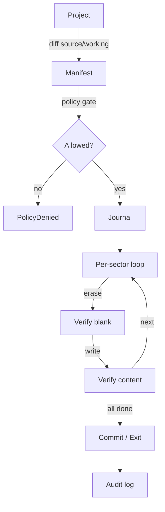

# Flashing safely

How `st::flash` writes a tuned calibration to an ECU without bricking
it. **Live-ECU flashing is currently bench-gated** — see status note
below.

!!! warning "Status (2026-06-19)"
    The flash orchestrator runs end-to-end against `MockTransport` and
    has been driven through partial live sequences on the bench rig.
    **A live flash to a customer car is not yet supported** — the gate
    is the bench-rig validation runbook
    ([`docs/42`](https://github.com/BuffJesus/SubuwuTuner/blob/main/docs/42-bench-rig-validation-runbook.md){ target="_blank" })
    + JTAG recovery
    ([`docs/43`](https://github.com/BuffJesus/SubuwuTuner/blob/main/docs/43-jtag-recovery.md){ target="_blank" }).
    Everything below describes what the orchestrator does when the gate
    clears.

## The flow



## Dry-run first

```bash
subuwutuner-cli flash-dry-run --project my-tune.stune
```

Emits the manifest — exact sectors, pre- and post-checksums, expected
runtime, and the policy-gate decision — without sending a single wire
byte. Read this before any real flash.

## Tune-export pipeline (LF79xxxP)

For FA20DIT (SH-2A LF79xxxP family) calibration writes, the
sum-preserving tune-export pipeline (`st::tune_export`) handles the
boot-integrity contract automatically:

```bash
subuwutuner-cli tune-export-build \
    --project my-tune.stune \
    -o flashable.bin
```

What it does for you:

- Verifies the u16 BE sum target `0x5AA5` over `[0x6000, 0x200000)`
- Emits a compensating balance write at `0x1FFFFE` to preserve the sum
- Skips writes into FACI-locked regions (`[0, 0x8000)`)
- Preserves boot-integrity signatures (`0x6000`, `0x6010`, `0x6C`, `0x1FFFF2`)
- Emits a skip-unchanged-blocks write plan (delta-flash friendly)

Cross-CID validated across LF79002P (bench donor) and LF79101P (the
e-tune CID on Cornelio's car).

Spec:
[`docs/44-tune-export.md`](https://github.com/BuffJesus/SubuwuTuner/blob/main/docs/44-tune-export.md){ target="_blank" }.

## Run the flash (when the gate clears)

```bash
subuwutuner-cli project-flash \
    --project my-tune.stune \
    --transport obdx --device COM5 \
    --authenticate --sa-variant ssmcan1-factory \
    --audit-log my-flash.audit
```

`project-flash` walks the manifest, applies the SA prelude, opens the
Programming session (DSC 0x10 0x02), erases each sector, writes through
TransferData (0x36) or — if armed — the 0xB6 bulk-transfer path, verifies
each sector, journals every step, and emits an audit record for every
state transition.

## Resume after power loss

```bash
subuwutuner-cli project-flash --resume \
    --project my-tune.stune \
    --transport obdx --device COM5 \
    --authenticate --sa-variant ssmcan1-factory
```

The journal in the project directory captures every verified step.
Resume picks up from the last verified step. The orchestrator
re-verifies the boundary before continuing.

## The 0xB6 bulk-transfer path (off by default)

The optional gated path:

```bash
# Build-time
cmake --preset win-mingw -DST_ENABLE_BULK_REFLASH_CIPHER=ON

# Run-time
subuwutuner-cli project-flash --enable-bulk-reflash-cipher ...
```

Both gates are required. Trade-off + failure modes:
[`docs/26-bulk-reflash-cipher.md`](https://github.com/BuffJesus/SubuwuTuner/blob/main/docs/26-bulk-reflash-cipher.md){ target="_blank" }.

## If something goes wrong

- **Verify failure mid-flash.** Orchestrator halts immediately. Run
  `project-flash --resume` to pick up; the resume path re-verifies
  before continuing.
- **NRC 0x22 from the commit routine.** The boot-integrity sum check
  failed. Re-verify your image with `checksum-verify`; the most likely
  cause is a balance-cell miscalculation in `tune-export-build`.
- **ECU silent on the bus after a failed write.** Likely boot integrity
  failure. JTAG recovery procedure:
  [`docs/43-jtag-recovery.md`](https://github.com/BuffJesus/SubuwuTuner/blob/main/docs/43-jtag-recovery.md){ target="_blank" }.

## Deeper detail

- [Brick protection](../concepts/brick-protection.md) — model + safety guarantees.
- [`docs/31-brick-protection-by-isa.md`](https://github.com/BuffJesus/SubuwuTuner/blob/main/docs/31-brick-protection-by-isa.md){ target="_blank" } — per-ISA recipes.
- [`docs/37-subaru-flash-protocol.md`](https://github.com/BuffJesus/SubuwuTuner/blob/main/docs/37-subaru-flash-protocol.md){ target="_blank" } — Subaru UDS flash sequence reference.
- [`docs/40-delta-flash-brick-protection.md`](https://github.com/BuffJesus/SubuwuTuner/blob/main/docs/40-delta-flash-brick-protection.md){ target="_blank" } — v1.5 differential-flash extension.
- [`docs/42-bench-rig-validation-runbook.md`](https://github.com/BuffJesus/SubuwuTuner/blob/main/docs/42-bench-rig-validation-runbook.md){ target="_blank" } — bench validation runbook.
